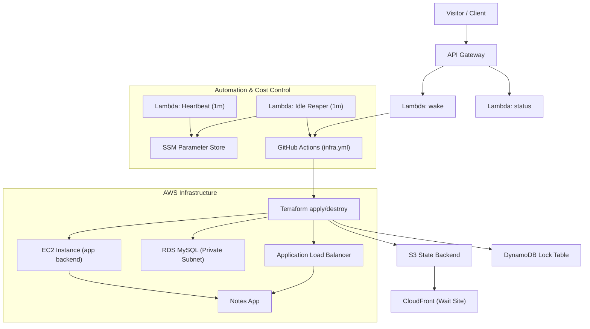
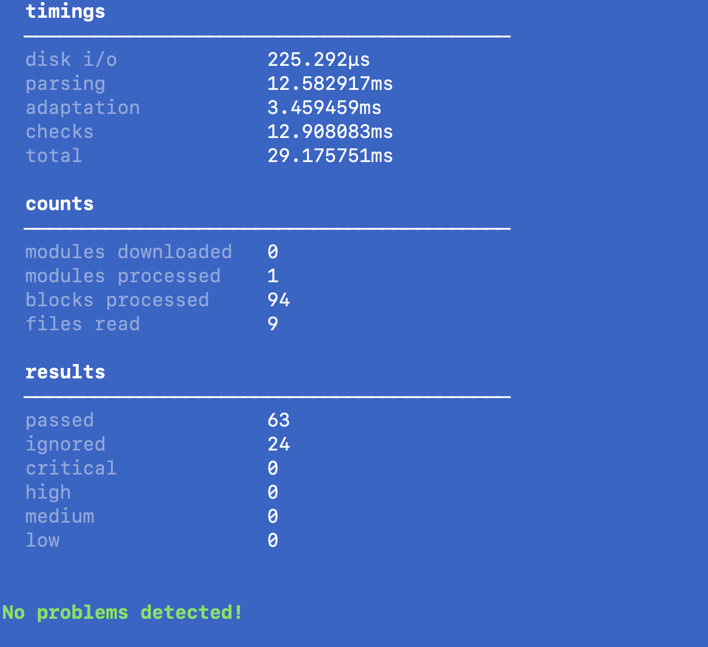

#  Ruslan AWS — Multi-Tier Infrastructure Demo

<p align="center">
  
  
  
  
  
  
  
  
</p>

<p align="center">
  
  
  
  
  
</p>

 **Wait Page:** [https://app.multi-tier.space](https://app.multi-tier.space)  
 **Main App:** [https://multi-tier.space](https://multi-tier.space)

This project demonstrates a **fully automated, cost-optimized multi-tier infrastructure on AWS**, provisioned with **Terraform** and orchestrated through **GitHub Actions**.

It includes:

- **On-demand wake/sleep automation**  
- **Serverless orchestration** using API Gateway, Lambda, and GitHub OIDC  
- **Secure configuration and secret management** (SSM + Secrets Manager)  
- **Full three-tier stack** with frontend, application layer, and database  
- **Auto-destroy of idle resources** — environment exists only while needed, then tears down automatically  
- **Static wait site** hosted on S3 + CloudFront, always available even when the environment sleeps  

---

##  Architecture Overview



---

##  Key AWS Services Used

| Service | Purpose |
|---|---|
| **Lambda** | Wake/Status automation, heartbeat, idle-reaper logic |
| **API Gateway (HTTP)** | Public entrypoint for wake/status endpoints |
| **EC2 (Amazon Linux 2023)** | Application compute layer for backend |
| **Application Load Balancer (ALB)** | Routing, health checks, HTTPS termination |
| **RDS MySQL (Private Subnets)** | Persistent database isolated from the public internet |
| **S3 + CloudFront** | Static wait site for `app.multi-tier.space` |
| **Route 53** | DNS management for both domains |
| **SSM Parameter Store** | Runtime configuration + heartbeat timestamp |
| **Secrets Manager** | GitHub token + AWS-managed RDS master password |
| **DynamoDB** | Terraform state locking (safe applies/destroys) |
| **IAM + OIDC** | Secure short-lived credentials for GitHub Actions |
| **CloudWatch Logs** | Centralized logging for all Lambdas |

---

##  Wake / Sleep Lifecycle

The environment uses a **cost-optimized wake/sleep model**:

- When idle, only the **static wait page** remains online (S3 + CloudFront).  
- When a user presses **“Wake up”**, API Gateway → Lambda → GitHub Actions triggers a full `terraform apply`.  
- The stack provisions EC2, ALB, RDS, IAM, VPC networking, and bootstrap scripts.  
- Once provisioning completes, the endpoint `https://multi-tier.space` becomes active and the “Open App” button unlocks.  
- A heartbeat Lambda updates `/multi-tier-demo/last_wake` every minute.  
- If no activity is detected, the Idle-Reaper Lambda triggers a `destroy` workflow.  
- The stack returns to the lightweight **idle state**, costing nearly zero.

**Lambdas involved:**

- `multi-tier-demo-wake` — triggers the GitHub Actions provision workflow  
- `multi-tier-demo-status` — reports live state (ready / waking / idle)  
- `multi-tier-demo-heartbeat` — updates last wake timestamp  
- `multi-tier-demo-idle-reaper` — destroys environment after inactivity  

This pattern allows the entire infrastructure to exist **only when needed**, and disappear completely when idle — ideal for demos, interviews, and credit-efficient cloud labs.

---

##  Application Layer — Notes App

This demo infrastructure hosts a lightweight **Notes App** built with a Node.js backend and a Bootstrap frontend.  
It demonstrates how a full‑stack application can be deployed, managed, and automatically destroyed on demand.

**Features:**
- Add, list, and delete notes through a simple REST API.  
- Frontend hosted on **S3 + CloudFront** (`https://app.multi-tier.space`).  
- Requests routed via **ALB** with health checks.  
- Data persisted in **Amazon RDS (MySQL)** located **in a private subnet** for enhanced security.  
- After successful provisioning, the live app is served at **https://multi-tier.space**.

---

###  Wait Page & Frontend Flow

The static **wait page** (hosted on [https://app.multi-tier.space](https://app.multi-tier.space)) acts as a **control dashboard** for managing infrastructure state.

When the system is idle, it remains online as a lightweight S3 + CloudFront site and provides:
- A **“Wake up”** button that triggers the GitHub Actions pipeline via API Gateway → Lambda → Terraform apply.  
- A **live progress bar** and **countdown timer** (≈12–15 minutes) indicating provisioning status.  
- A **status indicator** that enables the **“Open App”** button once the backend environment is fully deployed.  

Both `app.multi-tier.space` and `multi-tier.space` domains are managed via **Route 53** and integrated with CloudFront.  
This design ensures **zero‑cost idle time** — compute resources (EC2, RDS, ALB) are active only while the app is awake, while the static wait‑site remains accessible 24/7.

---

##  Project Structure

```
aws-multi-tier-infra/
├── infra/              # Terraform — core application infrastructure
├── lambda/             # Automation Lambdas (wake, status, heartbeat, idle-reaper)
├── app/                # Node.js Notes App (backend + static assets)
├── wait-site/          # Static "Wake" landing page (CloudFront + S3)
├── bootstrap/          # EC2 bootstrap (user_data.sh)
├── scripts/            # Systemd service units and helper scripts
├── docs/               # Architecture, SLO, ADR, runbooks, diagrams, screenshots
├── .github/            # GitHub Actions (infra, app, cleanup, Terraform CI)
├── LICENSE             # MIT License for the project
└── README.md           # Main project documentation
```

**Full detailed structure:** see [`docs/architecture.md`](./docs/architecture.md)

---

## 📘 Documentation

This repository includes a complete production-style documentation set:

- **Architecture** — [`docs/architecture.md`](./docs/architecture.md)
- **Cost Model** — [`docs/cost.md`](./docs/cost.md)
- **SLO & Performance** — [`docs/slo.md`](./docs/slo.md)
- **Monitoring Strategy** — [`docs/monitoring.md`](./docs/monitoring.md)
- **Threat Model** — [`docs/threat-model.md`](./docs/threat-model.md)

### ADR (Architectural Decisions)

- **ADR-0001: Why Terraform** — [`docs/adr/0001-why-terraform.md`](./docs/adr/0001-why-terraform.md)  
- **ADR-0002: Why OIDC Instead of IAM Users** — [`docs/adr/0002-why-oidc-instead-of-iam-users.md`](./docs/adr/0002-why-oidc-instead-of-iam-users.md)  
- **ADR-0003: Wake/Sleep Architecture Choice** — [`docs/adr/0003-wake-sleep-architecture-choice.md`](./docs/adr/0003-wake-sleep-architecture-choice.md)  
- **ADR-0004: Why RDS in a Private Subnet** — [`docs/adr/0004-why-rds-private-subnet.md`](./docs/adr/0004-why-rds-private-subnet.md)

### Runbooks (Operational Playbooks)
- **Wake Failure** — [`docs/runbooks/wake-failure.md`](./docs/runbooks/wake-failure.md)
- **Destroy Not Triggered** — [`docs/runbooks/destroy-not-triggered.md`](./docs/runbooks/destroy-not-triggered.md)
- **Rollback Procedure** — [`docs/runbooks/rollback.md`](./docs/runbooks/rollback.md)

### Diagrams
- **Architecture Diagram (Mermaid)** — [`docs/diagrams/architecture.md`](./docs/diagrams/architecture.md)
- **Sequence Diagram (Mermaid)** — [`docs/diagrams/sequence.md`](./docs/diagrams/sequence.md)

---

##  Environment Variables / Parameters

| Name | Location | Description |
|---|---|---|
| `gh/actions/token` | **AWS Secrets Manager** | GitHub PAT used by wake/idle automation Lambdas |
| `/multi-tier-demo/last_wake` | **SSM Parameter Store** | Timestamp of last heartbeat signal |
| `/multi-tier-demo/destroy_dispatched_epoch` | **SSM Parameter Store** | Guard to prevent repeated destroys |
| `IDLE_MINUTES` | **Lambda Env (idle_reaper)** | Threshold in minutes before triggering destroy |
| `GH_WORKFLOW` | **Lambda Env** | Target GitHub Actions workflow name |
| `ASG_NAME` | **Lambda Env** | (Optional) AutoScaling group name (if used) |
| `REGION` | **Lambda Env** | AWS region used for API calls |

---

##  Cost Optimization Principles

- Auto-destroy idle infrastructure via Idle-Reaper Lambda.  
- Terraform backend in **S3 + DynamoDB** for safe, resumable deploys.    
- Minimal EC2 and RDS footprint to stay within AWS credits.  
- Database in **private subnets** with no public exposure.  
- ALB health checks drive stability and cost-efficient uptime.  
- DNS hosted in **Route 53**; GitHub OIDC replaces long-lived IAM keys.  

Estimated runtime cost: **<$1/day** when active; **~$0 when sleeping.**

---

##  Common Terraform & AWS CLI Commands

### Terraform Lifecycle
```bash
terraform init
terraform plan -out=tfplan
terraform apply -auto-approve tfplan
terraform destroy -auto-approve
```

### AWS CLI Checks
```bash
aws ssm get-parameter --name /multi-tier-demo/last_wake --query 'Parameter.Value' --output text
aws logs tail /aws/lambda/multi-tier-demo-idle-reaper --follow
aws events list-rules --name-prefix multi-tier-demo
aws lambda get-function-configuration --function-name multi-tier-demo-idle-reaper --query 'Environment.Variables.IDLE_MINUTES' --output text
```

---

##  Secrets Management

- Application DB master password is managed by **AWS RDS** via `manage_master_user_password`  
  (stored in an AWS-managed secret in **Secrets Manager**, never in Terraform state).
- GitHub token for wake/idle automation is stored in **AWS Secrets Manager** and referenced by name from Lambda.
- Non-sensitive configuration (bucket names, ports, DB host/name, app port, artifact key, etc.) lives in  
  **SSM Parameter Store** as plain `String` parameters.
- Optional SSM `SecureString` parameters are available if you ever decide to self-manage database passwords,  
  but they are **disabled by default** in this demo.

---

###  Workflow Hygiene & Security

- **Automated log cleanup** — completed GitHub Actions runs are automatically purged by a dedicated `cleanup-logs` workflow, keeping the repository lean and free from obsolete logs.  
- **Sensitive data masking** — all AWS account IDs, domain names, and API endpoints are masked in workflow output for safe, production-grade logging.  
- **Minimal retention policy** — workflow artifacts and build logs are removed after completion to reduce surface exposure and unnecessary storage costs.

---

##  GitHub Actions Automation

- Workflow: `.github/workflows/infra.yml`  
- Triggers: `workflow_dispatch`, `repository_dispatch`, or wake via Lambda  
- Uses **OIDC federated role** for short‑lived AWS credentials  
- Built‑in **kill switch**: repository variable `INFRA_ARMED` must be `on`  
- Concurrency control ensures one infra job at a time

---

## 🛠 Terraform CI (Pull Request Checks)

Every pull request automatically runs a full IaC validation pipeline:

- `terraform fmt -check -recursive`
- `terraform init -backend=false`
- `terraform validate`
- **TFLint** (linting)
- **tfsec** (security scan, soft-fail)
- **Checkov** (policy-as-code/security rules)
- Plan artifact generation (coming soon)

Workflow: `.github/workflows/terraform-ci.yml`

---

##  Budget & Credits

Optimized for **AWS Free Tier / Credits**:

- Minimal EC2 runtime (environment lives only while “awake”).  
- RDS is **created on wake and destroyed on sleep** together with the rest of the stack.  
- S3/CloudFront static content billed in pennies.  
- DynamoDB lock table uses `PAY_PER_REQUEST`.  
- GitHub Actions runs only when invoked by the wake/CI flow.

---

##  Quick Reference

| Command | Purpose |
|---|---|
| `gh workflow run infra.yml -f action=apply -f auto_approve=true` | Manually start environment |
| `gh variable set INFRA_ARMED -R rusets/aws-multi-tier-infra -b on` | Enable automated destroy/apply |
| `aws ssm delete-parameter --name /multi-tier-demo/destroy_dispatched_epoch` | Reset cooldown guard |
| `aws lambda invoke --function-name multi-tier-demo-idle-reaper --payload '{}' /dev/stdout` | Manual reaper test |
| `aws cloudfront create-invalidation --distribution-id EVOB3TLZSKCR0 --paths /index.html` | Force refresh wait page |

---

##  Security Posture & Static Analysis

This project is not just “it works” Terraform – it is fully wired with static analysis and security tooling.  
All high/critical findings are either **fixed** or **explicitly suppressed with justification** for this short-lived demo environment.

### Tools & what they cover

- **terraform fmt / terraform validate**
  - Enforced locally with:
    - `terraform fmt -recursive`
    - `terraform validate`
  - Guarantees consistent style and a syntactically valid state across all modules.

- **tflint (with recursive scan)**
  - Run as:
    - `tflint --recursive`
  - No unused variables, missing required providers, or obvious config mistakes.
  - Example: `null_resource` usage backed by an explicit `null` provider in `required_providers`.

- **tfsec**
  - Run against the whole `infra` directory:
    - `tfsec .`
  - All critical issues are either fixed or suppressed inline where the “secure by default” recommendation conflicts with:
    - **Cost** (e.g., Multi-AZ RDS, WAF, long log retention)
    - **Demo lifetime** (stack is auto-destroyed shortly after use)
    - **Simplicity for interviews** (focus on architecture patterns rather than enterprise add-ons).

- **Checkov**
  - Run as:
    - `checkov -d .`
  - The report has **0 FAILED checks**.
  - Every non-default decision that weakens the “perfectly locked-down enterprise” posture is:
    - Tagged with an inline `#checkov:skip=…` on the exact resource
    - Accompanied by a short, honest justification in English.

### Where we consciously accept trade-offs

This is a **short-lived demo stack** in an isolated AWS account, optimized for:
- Low cost
- Easy tear-down from CI/CD
- Maximum readability for interviews

Because of that, some “paranoid defaults” are intentionally relaxed and clearly documented:

- **S3 (assets + logs)**
  - No cross-region replication (Checkov CKV_AWS_144 skipped) – not needed for demo data.
  - SSE-S3 (AES256) instead of KMS CMK (CKV_AWS_145 skipped) – avoids extra KMS complexity and cost.
  - No event notifications (CKV2_AWS_62 skipped) – this project doesn’t react to S3 events.

- **RDS instance**
  - Single-AZ, no Multi-AZ (CKV_AWS_157 skipped) – cheaper and sufficient for demo traffic.
  - Deletion protection disabled (CKV_AWS_293 skipped) – CI/CD must be able to destroy the stack automatically.
  - Query logging + enhanced monitoring disabled (CKV2_AWS_30, CKV_AWS_129, CKV_AWS_118 skipped) – detailed DB telemetry is overkill for a disposable environment.

- **Application Load Balancer**
  - No WAF attached (CKV2_AWS_28 skipped) – would require extra resources and configuration for a simple demo.
  - No access logging to S3 (CKV_AWS_91 skipped) – avoids extra buckets and log storage cost.
  - Deletion protection disabled (CKV_AWS_150 skipped) – again, CI/CD auto-destroy is a first-class requirement.

- **VPC Flow Logs & Lambda log groups**
  - Short log retention and default CloudWatch encryption (CKV_AWS_338, CKV_AWS_158 skipped):
    - Just enough to debug,
    - Not enough to accumulate a long-term bill.

- **SSM Parameters**
  - Non-secret values (bucket names, ports, DB host, DB name, etc.) are stored as plain `String`.
  - Checkov rule `CKV2_AWS_34` is skipped for those parameters – secrets stay in AWS-managed places (RDS, Secrets Manager), config stays readable in SSM.

- **Lambda functions (wake, idle_reaper, status)**
  - Not placed in a VPC (CKV_AWS_117 skipped) – they only reach public endpoints (GitHub, public ALB), so VPC ENIs would add cost and cold-start latency without adding real security here.
  - No DLQ (CKV_AWS_116 skipped) – functions are idempotent and safe to fail (wake/status polling).
  - Env encryption, code signing, X-Ray tracing are disabled and explicitly skipped (CKV_AWS_173, CKV_AWS_272, CKV_AWS_50) to keep the functions simple and cheap for a demo.

- **IAM for idle reaper**
  - One policy document uses a wildcard for `ssm:GetParameter` to read a heartbeat value.
  - Checkov rules `CKV_AWS_108` and `CKV_AWS_356` are skipped with a clear comment:
    - Access is limited to an isolated demo account,
    - The goal is to keep the policy easy to read/explain in interviews.

### Summary

- All Terraform code is **linted and formatted**.
- All security scanners (**tfsec + Checkov**) are **green**:
  - No silent misconfigurations,
  - All intentional deviations are **documented inline**.
- The end result is a **realistic, interview-friendly AWS demo**:
  - Strong enough to show you understand security,
  - Pragmatic enough to stay cheap, disposable, and easy to reason about.

---

##  Screenshots

###  Wait Page — Idle State
Shows the static wait site hosted on **S3 + CloudFront** while the environment is asleep.


###  Wake Progress — Provisioning in Progress
Real-time progress bar and countdown during Terraform apply (≈12–15 minutes).


###  Notes App — Fully Deployed
The application served via **ALB → EC2 → Node.js** with RDS backend online.


###  Static Analysis — tfsec, tflint, checkov
All Terraform security and lint checks passed successfully.  
Screenshot below shows a `tfsec` run (63 checks passed, 24 skipped intentionally with inline justifications).


###  RDS Console — Private Database Layer
RDS instance running in **private subnets**, using AWS-managed master password.


###  Lambda Heartbeat — Activity Tracking
Heartbeat Lambda updates `last_wake` every minute via SSM.


###  GitHub Actions — Infra Pipeline Runs
Shows apply/destroy workflows triggered by wake/sleep automation.


---

## **Author & Portfolio**

Portfolio website: https://rusets.com  
More real AWS, DevOps, IaC, and automation projects by **Ruslan AWS**.

---

## License

Released under the MIT License.  
See the LICENSE file for full details.

Branding name “🚀 Ruslan AWS” and related visuals may not be reused or rebranded without permission.