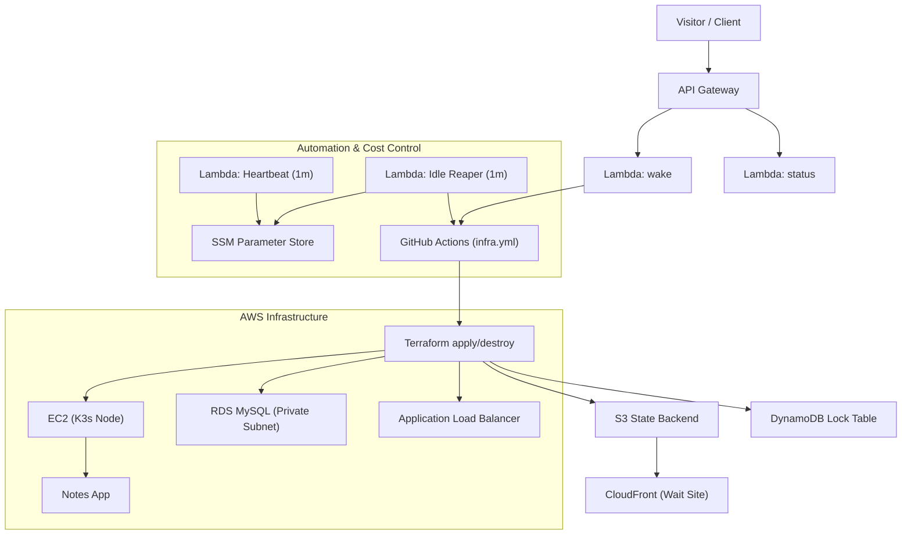

# 🚀 Ruslan AWS — Multi-Tier Infrastructure Demo

🌐 **Live Demo:** [https://app.multi-tier.space](https://app.multi-tier.space)  
An on-demand, cost-optimized environment that automatically wakes, deploys, and sleeps — powered by **AWS + Terraform + GitHub Actions**.

This repository demonstrates a **fully automated, cost-efficient AWS multi-tier environment**, provisioned via **Terraform** and managed through **GitHub Actions**. It integrates a wake/sleep Lambda flow, secure secret storage, and on-demand infrastructure lifecycle.

---

## ⚙️ Architecture Overview



---

## 🧩 Key AWS Services Used

| Service | Purpose |
|----------|----------|
| **Lambda** | Wake, Status, Heartbeat, Idle-Reaper automation |
| **API Gateway (HTTP)** | Public endpoint for wake/status triggers |
| **EC2 (Amazon Linux 2023)** | K3s-based lightweight cluster running demo app |
| **RDS (MySQL, Private Subnet)** | Secure database isolated from public access |
| **S3 + CloudFront** | Static wait-site hosting (https://app.multi-tier.space) |
| **SSM Parameter Store** | Secure config & secret storage |
| **DynamoDB** | Terraform state locking table |
| **IAM Roles & OIDC** | Secure GitHub Actions integration |
| **CloudWatch Logs** | Centralized logging for Lambdas and workflows |

---

## 💤 Wake/Sleep Lifecycle

The environment sleeps when idle and wakes only when requested.

**Lambdas involved:**
- **`multi-tier-demo-heartbeat`** — updates `/multi-tier-demo/last_wake` every minute.
- **`multi-tier-demo-idle-reaper`** — checks last wake timestamp; if >10 min, triggers destroy via GitHub Actions.
- **`multi-tier-demo-status`** — reports live status (ready / waking / idle) to frontend.
- **`multi-tier-demo-wake`** — receives POST requests from the frontend and starts the apply workflow.

**Default timings:**
- Heartbeat: every **1 minute**
- Idle reaper destroy threshold: **10 minutes**
- Cooldown guard between destroys: **30 minutes**

---

## 📝 Application Layer — Notes App

This demo infrastructure hosts a lightweight **Notes App** built with a Node.js backend and a Bootstrap frontend.  
It demonstrates how a full stack application can be deployed, managed, and automatically destroyed on demand.

**Features:**
- Add, list, and delete notes through a simple REST API.  
- Backend served on **K3s EC2 Node** (NodePort `30080`).  
- Frontend hosted on **S3 + CloudFront** (`https://app.multi-tier.space`).  
- Data persisted in **Amazon RDS (MySQL)**, located **in a private subnet** for enhanced security.  
- API endpoints exposed via **Ingress / ALB** with health checks.

**App structure:**
```
aws-multi-tier-infra/
├── app/                     # Notes application code
│   ├── server.js            # Express.js backend (REST API)
│   ├── package.json         # Node.js dependencies
│   ├── public/
│   │   ├── index.html       # Bootstrap-based UI
│   │   ├── script.js        # Fetch API to call backend
│   │   └── style.css
│   └── Dockerfile           # Container definition
├── infra/                   # Terraform IaC
│   ├── main.tf              # Core resources
│   ├── variables.tf         # Configuration inputs
│   ├── outputs.tf           # Outputs (URLs, IDs, etc.)
│   ├── backend.tf           # Remote state (S3 + DynamoDB)
│   ├── control-plane/       # Lambda packaging and schedules
│   └── .terraform.lock.hcl  # Provider lock file
├── .github/workflows/       # GitHub Actions automation
│   ├── infra.yml            # Deploy/destroy workflow
│   └── app.yml              # Optional app redeploy workflow
└── docs/                    # Diagrams and screenshots
```

The **Notes App** serves as a realistic, minimal workload for demonstrating:
- Continuous delivery from GitHub → AWS.  
- Secure parameter storage (DB credentials in SSM).  
- Full wake → apply → idle → destroy cycle.  
- Zero-cost idle state and reproducible environment creation.

---

## 💡 Cost Optimization Principles

- Auto-destroy idle infrastructure via Idle-Reaper Lambda.
- Stateless backend (S3 + DynamoDB) allows fast re-provisioning.
- Uses minimal EC2 (t3.small) and RDS (free-tier) to stay within credits.
- Database is deployed in **private subnets** with no public exposure.  
- Static website hosted on S3 + CloudFront (no compute cost).
- GitHub OIDC replaces long-lived IAM keys.

Estimated runtime cost: **<$1/day** when active; **~$0 when sleeping.**

---

## 🧰 Common Terraform & AWS CLI Commands

### Terraform Lifecycle

```bash
terraform init
terraform plan -out=tfplan
terraform apply -auto-approve tfplan
terraform destroy -auto-approve
```

### AWS CLI Checks

```bash
aws ssm get-parameter --name /multi-tier-demo/last_wake --query 'Parameter.Value' --output text
aws logs tail /aws/lambda/multi-tier-demo-idle-reaper --follow
aws events list-rules --name-prefix multi-tier-demo
aws lambda get-function-configuration --function-name multi-tier-demo-idle-reaper --query 'Environment.Variables.IDLE_MINUTES' --output text
```

---

## 🔐 Secrets Management

All secrets (GitHub token, DB credentials, API keys) are stored in **AWS SSM Parameter Store** as **SecureString**.  
Terraform and Lambdas read them dynamically — no plaintext secrets in `.tfvars` or source code.

---

## 🚀 GitHub Actions Automation

- Workflow: `.github/workflows/infra.yml`
- Triggers: `workflow_dispatch`, `repository_dispatch`, or wake via Lambda
- Uses **OIDC federated role** for short-lived AWS credentials
- Built-in **kill switch**: variable `INFRA_ARMED` must be `on` for automation
- Concurrency control ensures one infra job at a time

---

## 💵 Budget & Credits

Optimized for **AWS Free Tier / Student Credits**:

- Minimal EC2 runtime (<20 min active window)
- RDS stopped outside wake period
- S3/CloudFront static content billed in pennies
- DynamoDB lock table PAY_PER_REQUEST
- GitHub Actions used only when invoked by API

---

## 🧠 Quick Reference

| Command | Purpose |
|----------|----------|
| `gh workflow run infra.yml -f action=apply -f auto_approve=true` | Manually start environment |
| `gh variable set INFRA_ARMED -R rusets/aws-multi-tier-infra -b on` | Enable automated destroy/apply |
| `aws ssm delete-parameter --name /multi-tier-demo/destroy_dispatched_epoch` | Reset cooldown guard |
| `aws lambda invoke --function-name multi-tier-demo-idle-reaper --payload '{}' /dev/stdout` | Manual reaper test |
| `aws cloudfront create-invalidation --distribution-id EVOB3TLZSKCR0 --paths /index.html` | Force refresh static site |

---

## 🧾 Summary

This project demonstrates **end-to-end automation**: from a user clicking **Wake Up** on a static web page to a **fully deployed multi-tier app**, automatically destroyed when idle.  
It combines **AWS-native services**, **Terraform**, and **GitHub Actions** into a cost-effective, production-style DevOps showcase.

> _Built with precision and simplicity — from DevOps to design._  
> **© Ruslan Dashkin (Ruslan AWS)**
