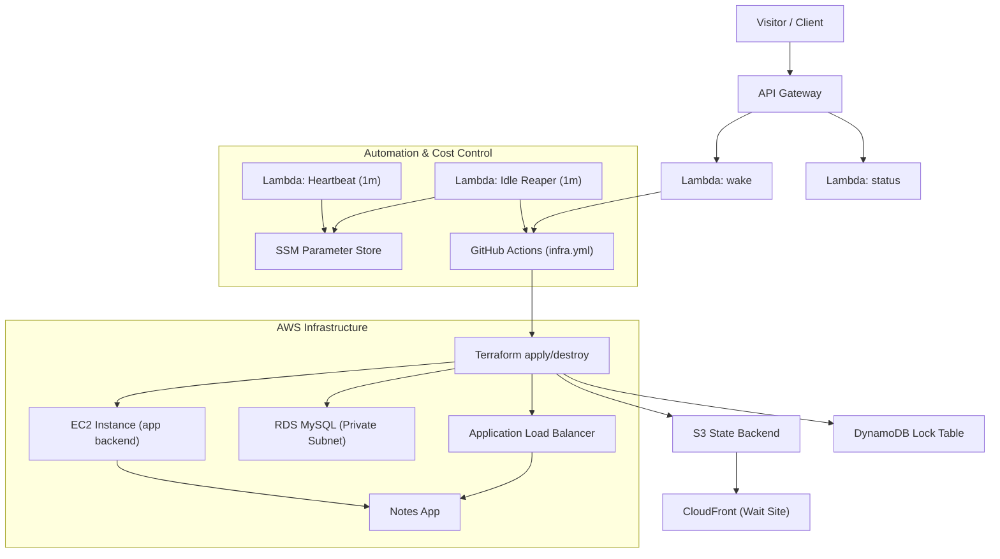

#  Ruslan AWS — Multi-Tier Infrastructure Demo

<p align="center">
  
  
  
  
  
  
  
  
</p>

 **Wait Page:** [https://app.multi-tier.space](https://app.multi-tier.space)  
 **Main App:** [https://multi-tier.space](https://multi-tier.space)

This project demonstrates a **fully automated, cost-optimized multi-tier infrastructure on AWS**, provisioned via **Terraform** and orchestrated with **GitHub Actions**.  
It showcases **on-demand environment wake/sleep**, **secure secret storage (SSM Parameter Store)**, and **serverless orchestration (API Gateway + Lambda)** for real-world DevOps automation.

The solution provisions a complete **three-tier architecture** — frontend, application, and database — and automatically destroys idle resources to achieve near-zero cost.

---

##  Architecture Overview



---

##  Key AWS Services Used

| Service | Purpose |
|---|---|
| **Lambda** | Wake, Status, Heartbeat, Idle-Reaper automation |
| **API Gateway (HTTP)** | Public endpoint for wake/status triggers |
| **EC2 (Amazon Linux 2023)** | Runs backend app and connects to ALB |
| **Application Load Balancer (ALB)** | Routes requests, performs health checks, and manages scaling |
| **RDS (MySQL, Private Subnet)** | Secure database isolated from public access |
| **S3 + CloudFront** | Static wait-site hosting (`app.multi-tier.space`) |
| **Route 53** | DNS management for `multi-tier.space` and `app.multi-tier.space` |
| **SSM Parameter Store** | Secure config & secret storage |
| **DynamoDB** | Terraform state locking table |
| **IAM + OIDC (GitHub)** | Short‑lived credentials for CI |
| **CloudWatch Logs** | Centralized logging for Lambdas and workflows |

---

##  Wake/Sleep Lifecycle

The environment sleeps when idle and wakes only when requested.

**Lambdas involved:**
- **`multi-tier-demo-heartbeat`** — updates `/multi-tier-demo/last_wake` every minute.
- **`multi-tier-demo-idle-reaper`** — checks last wake timestamp; if threshold exceeded, triggers `destroy` via GitHub Actions.
- **`multi-tier-demo-status`** — reports live status (ready / waking / idle) to frontend.
- **`multi-tier-demo-wake`** — receives POST requests from the wait page and starts the `apply` workflow.

## Default Timings (Current Configuration)

- **Heartbeat Lambda**  
  Updates `/multi-tier-demo/last_wake` every **60 seconds**.

- **Idle-Reaper Threshold**  
  Automatically triggers `destroy` after **10 minutes** of inactivity.

- **Cooldown Guard**  
  Prevents repeated destroy calls for **30 minutes** after the last destroy event.

- **Full Wake Cycle Duration**  
  Total time for provisioning (Terraform apply + service warm-up): **12–15 minutes**.

---

##  Application Layer — Notes App

This demo infrastructure hosts a lightweight **Notes App** built with a Node.js backend and a Bootstrap frontend.  
It demonstrates how a full‑stack application can be deployed, managed, and automatically destroyed on demand.

**Features:**
- Add, list, and delete notes through a simple REST API.  
- Frontend hosted on **S3 + CloudFront** (`https://app.multi-tier.space`).  
- Requests routed via **ALB** with health checks.  
- Data persisted in **Amazon RDS (MySQL)** located **in a private subnet** for enhanced security.  
- After successful provisioning, the live app is served at **https://multi-tier.space**.

---

###  Wait Page & Frontend Flow

The static **wait page** (hosted on [https://app.multi-tier.space](https://app.multi-tier.space)) acts as a **control dashboard** for managing infrastructure state.

When the system is idle, it remains online as a lightweight S3 + CloudFront site and provides:
- A **“Wake up”** button that triggers the GitHub Actions pipeline via API Gateway → Lambda → Terraform apply.  
- A **live progress bar** and **countdown timer** (≈12–15 minutes) indicating provisioning status.  
- A **status indicator** that enables the **“Open App”** button once the backend environment is fully deployed.  

Both `app.multi-tier.space` and `multi-tier.space` domains are managed via **Route 53** and integrated with CloudFront.  
This design ensures **zero‑cost idle time** — compute resources (EC2, RDS, ALB) are active only while the app is awake, while the static wait‑site remains accessible 24/7.

---

##  Project Structure

```
aws-multi-tier-infra/
├── infra/              # Terraform — core application infrastructure
├── lambda/             # Automation Lambdas (wake, status, heartbeat, idle-reaper)
├── app/                # Node.js Notes App (backend + static assets)
├── wait-site/          # Static "Wake" landing page (CloudFront + S3)
├── bootstrap/          # EC2 bootstrap (user_data.sh)
├── scripts/            # Systemd service units and helper scripts
├── docs/               # Architecture, SLO, ADR, runbooks, diagrams, screenshots
└── .github/            # GitHub Actions (infra, app, cleanup, Terraform CI)
```

**Full detailed structure:** see [`docs/architecture.md`](./docs/architecture.md)

---

## 📘 Documentation

This repository includes a complete production-style documentation set:

- **Architecture** — [`docs/architecture.md`](./docs/architecture.md)
- **Cost Model** — [`docs/cost.md`](./docs/cost.md)
- **SLO & Performance** — [`docs/slo.md`](./docs/slo.md)
- **Monitoring Strategy** — [`docs/monitoring.md`](./docs/monitoring.md)
- **Threat Model** — [`docs/threat-model.md`](./docs/threat-model.md)

### ADR (Architectural Decisions)

- **ADR-0001: Why Terraform** — [`docs/adr/0001-why-terraform.md`](./docs/adr/0001-why-terraform.md)  
- **ADR-0002: Why OIDC Instead of IAM Users** — [`docs/adr/0002-why-oidc-instead-of-iam-users.md`](./docs/adr/0002-why-oidc-instead-of-iam-users.md)  
- **ADR-0003: Wake/Sleep Architecture Choice** — [`docs/adr/0003-wake-sleep-architecture-choice.md`](./docs/adr/0003-wake-sleep-architecture-choice.md)  
- **ADR-0004: Why RDS in a Private Subnet** — [`docs/adr/0004-why-rds-private-subnet.md`](./docs/adr/0004-why-rds-private-subnet.md)

### Runbooks (Operational Playbooks)
- **Wake Failure** — [`docs/runbooks/wake-failure.md`](./docs/runbooks/wake-failure.md)
- **Destroy Not Triggered** — [`docs/runbooks/destroy-not-triggered.md`](./docs/runbooks/destroy-not-triggered.md)
- **Rollback Procedure** — [`docs/runbooks/rollback.md`](./docs/runbooks/rollback.md)

### Diagrams
- **Architecture Diagram (Mermaid)** — [`docs/diagrams/architecture.md`](./docs/diagrams/architecture.md)
- **Sequence Diagram (Mermaid)** — [`docs/diagrams/sequence.md`](./docs/diagrams/sequence.md)

---

##  Environment Variables / Parameters

| Name | Location | Description |
|---|---|---|
| `/multi-tier-demo/github_token` | **SSM Parameter Store** | Secure GitHub PAT used by Idle Reaper |
| `/multi-tier-demo/last_wake` | **SSM Parameter Store** | Timestamp of last heartbeat signal |
| `/multi-tier-demo/destroy_dispatched_epoch` | **SSM Parameter Store** | Guard to prevent repeated destroys |
| `IDLE_MINUTES` | **Lambda Env (idle_reaper)** | Threshold before triggering destroy |
| `GH_WORKFLOW` | **Lambda Env** | Target GitHub Actions workflow name |
| `ASG_NAME` | **Lambda Env** | (Optional) AutoScaling group name |
| `REGION` | **Lambda Env** | AWS region used for API calls |

---

##  Cost Optimization Principles

- Auto-destroy idle infrastructure via Idle-Reaper Lambda.  
- Terraform backend in **S3 + DynamoDB** for safe, resumable deploys.    
- Minimal EC2 and RDS footprint to stay within AWS credits.  
- Database in **private subnets** with no public exposure.  
- ALB health checks drive stability and cost-efficient uptime.  
- DNS hosted in **Route 53**; GitHub OIDC replaces long-lived IAM keys.  

Estimated runtime cost: **<$1/day** when active; **~$0 when sleeping.**

---

##  Common Terraform & AWS CLI Commands

### Terraform Lifecycle
```bash
terraform init
terraform plan -out=tfplan
terraform apply -auto-approve tfplan
terraform destroy -auto-approve
```

### AWS CLI Checks
```bash
aws ssm get-parameter --name /multi-tier-demo/last_wake --query 'Parameter.Value' --output text
aws logs tail /aws/lambda/multi-tier-demo-idle-reaper --follow
aws events list-rules --name-prefix multi-tier-demo
aws lambda get-function-configuration --function-name multi-tier-demo-idle-reaper --query 'Environment.Variables.IDLE_MINUTES' --output text
```

---

##  Secrets Management

All secrets (GitHub token, DB credentials, API keys) are stored in **AWS SSM Parameter Store** as **SecureString**.  
Terraform and Lambdas read them dynamically — no plaintext secrets in `.tfvars` or source code.

---

###  Workflow Hygiene & Security

- **Automated log cleanup** — completed GitHub Actions runs are automatically purged by a dedicated `cleanup-logs` workflow, keeping the repository lean and free from obsolete logs.  
- **Sensitive data masking** — all AWS account IDs, domain names, and API endpoints are masked in workflow output for safe, production-grade logging.  
- **Minimal retention policy** — workflow artifacts and build logs are removed after completion to reduce surface exposure and unnecessary storage costs.

---

##  GitHub Actions Automation

- Workflow: `.github/workflows/infra.yml`  
- Triggers: `workflow_dispatch`, `repository_dispatch`, or wake via Lambda  
- Uses **OIDC federated role** for short‑lived AWS credentials  
- Built‑in **kill switch**: repository variable `INFRA_ARMED` must be `on`  
- Concurrency control ensures one infra job at a time

---

## 🛠 Terraform CI (Pull Request Checks)

Every pull request automatically runs a full IaC validation pipeline:

- `terraform fmt -check -recursive`
- `terraform init -backend=false`
- `terraform validate`
- **TFLint** (linting)
- **tfsec** (security scan, soft-fail)
- (optional) **Checkov**
- Plan artifact generation (coming soon)

Workflow: `.github/workflows/terraform-ci.yml`

---

##  Budget & Credits

Optimized for **AWS Free Tier / Credits**:

- Minimal EC2 runtime (environment lives only while “awake”).  
- RDS is **created on wake and destroyed on sleep** together with the rest of the stack.  
- S3/CloudFront static content billed in pennies.  
- DynamoDB lock table uses `PAY_PER_REQUEST`.  
- GitHub Actions runs only when invoked by the wake/CI flow.

---

##  Quick Reference

| Command | Purpose |
|---|---|
| `gh workflow run infra.yml -f action=apply -f auto_approve=true` | Manually start environment |
| `gh variable set INFRA_ARMED -R rusets/aws-multi-tier-infra -b on` | Enable automated destroy/apply |
| `aws ssm delete-parameter --name /multi-tier-demo/destroy_dispatched_epoch` | Reset cooldown guard |
| `aws lambda invoke --function-name multi-tier-demo-idle-reaper --payload '{}' /dev/stdout` | Manual reaper test |
| `aws cloudfront create-invalidation --distribution-id EVOB3TLZSKCR0 --paths /index.html` | Force refresh wait page |

---

##  Screenshots

###  Wait Page — Idle State
Shows the static wait site hosted on **S3 + CloudFront** while the environment is asleep.


###  Wake Progress — Provisioning in Progress
Real-time progress bar and countdown during Terraform apply (≈12–15 minutes).


###  Notes App — Fully Deployed
The application served via **ALB → EC2 → Node.js** with RDS backend online.


###  RDS Console — Private Database Layer
RDS instance running in **private subnets**, using AWS-managed master password.


###  Lambda Heartbeat — Activity Tracking
Heartbeat Lambda updates `last_wake` every minute via SSM.


###  GitHub Actions — Infra Pipeline Runs
Shows apply/destroy workflows triggered by wake/sleep automation.


---

##  License

Released under the **MIT License** — feel free to use, fork, and learn from it.  
© Ruslan Dashkin (🚀Ruslan AWS)
Branding name “🚀Ruslan AWS” and related visuals are protected; commercial reuse or rebranding without permission is prohibited.
