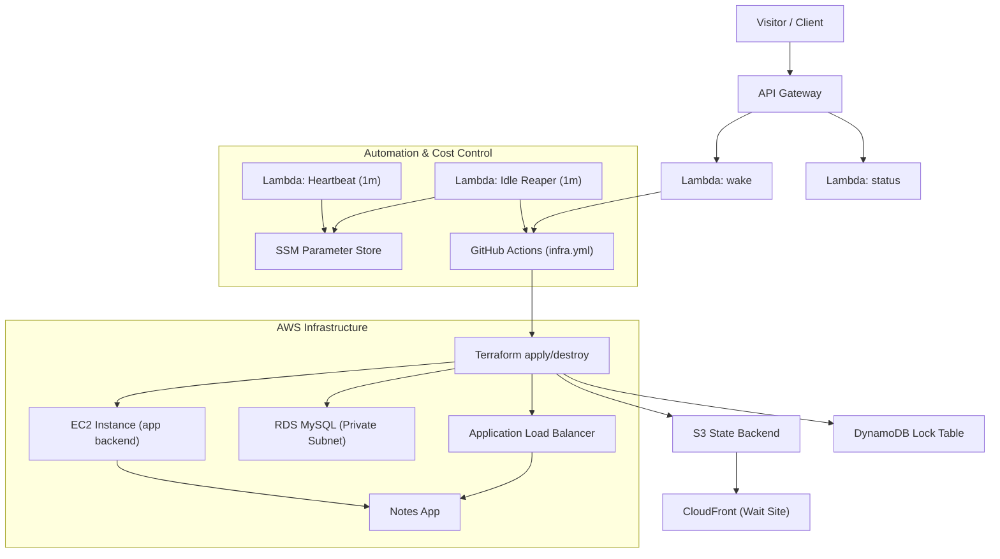

# AWS Multi-Tier Infrastructure — Wake/Sleep Platform

<p align="center">
  
  
  
  
  
  
</p>

 **Wait Page:** [https://app.multi-tier.space](https://app.multi-tier.space)  
 **Main App:** [https://multi-tier.space](https://multi-tier.space)

I designed and built this fully automated, cost-optimized multi-tier AWS infrastructure to demonstrate production-grade Infrastructure as Code, CI/CD automation, and serverless orchestration patterns.

It includes:

- **On-demand wake/sleep lifecycle**  
- **Serverless control plane** powered by API Gateway, Lambda, and GitHub OIDC  
- **Secure configuration and secrets management** using SSM Parameter Store and AWS Secrets Manager  
- **Complete three-tier architecture** with frontend, application layer, and database  
- **Automatic idle teardown** — the environment exists only when needed and destroys itself when inactive  
- **Static wait site** hosted on S3 + CloudFront, always available even while compute resources are offline  

---

##  Architecture Overview



---

## Key AWS Services Used

| Service | Role in Architecture |
|---|---|
| **AWS Lambda** | Control-plane logic (wake, status, heartbeat, idle reaper) |
| **Amazon API Gateway (HTTP API)** | Public entry point for infrastructure lifecycle endpoints |
| **Amazon EC2 (Amazon Linux 2023)** | Application compute layer (Node.js backend) |
| **Application Load Balancer (ALB)** | Traffic routing, health checks, TLS termination |
| **Amazon RDS (MySQL, Private Subnets)** | Isolated relational database layer |
| **Amazon S3 + CloudFront** | Static wait site and global content delivery |
| **Amazon Route 53** | DNS management for application and wait domains |
| **AWS Systems Manager (SSM)** | Runtime configuration and lifecycle state tracking |
| **AWS Secrets Manager** | Secure storage for GitHub token and RDS master credentials |
| **Amazon DynamoDB** | Terraform state locking for safe concurrent operations |
| **IAM + OIDC Federation** | Short-lived, keyless authentication for GitHub Actions |
| **Amazon CloudWatch Logs** | Centralized logging and Lambda observability |
---

## Automation Reliability Note

During development, the auto-destroy workflow stopped triggering after the configured idle timeout.

The root cause was an expired GitHub Personal Access Token stored in AWS SSM.  
The GitHub workflow dispatch request returned HTTP 401 (Bad credentials), preventing the `destroy` workflow from executing.

Infrastructure logic and Terraform configuration were correct.  
The failure occurred at the external GitHub API authentication boundary.

After rotating the token and updating the SSM parameter, destroy automation resumed immediately.

This incident highlights a critical dependency on external credential lifecycle management.

In production, external authentication should not rely on manually rotated Personal Access Tokens.  
A GitHub App with short-lived installation tokens or automated secret expiry monitoring would eliminate this single point of failure.

---

## Scaling Stability Improvement

During scaling events the application intermittently returned 502 errors.

Root cause analysis showed that ALB health checks validated process uptime only, while the application depended on active RDS connectivity. Instances were marked healthy before downstream dependencies were fully ready.

Health checks were redesigned to validate true application readiness, aligning ALB behavior with Auto Scaling lifecycle.

Result: stable instance replacement, predictable scaling behavior, and elimination of cascading 502 errors.

---

## Wake / Sleep Lifecycle

The platform implements an on-demand wake/sleep lifecycle to minimize idle cloud cost.

- In idle state, only the static wait site remains online (S3 + CloudFront).
- Pressing **Wake up** triggers API Gateway → Lambda → GitHub Actions → `terraform apply`.
- Terraform provisions the full stack: VPC, IAM, EC2, ALB, RDS, and bootstrap configuration.
- Once provisioning completes, `https://multi-tier.space` becomes available.
- A heartbeat Lambda updates `/multi-tier-demo/last_wake` every minute.
- After the configured idle threshold, the Idle-Reaper Lambda dispatches a `destroy` workflow.
- Terraform removes all compute and database resources, returning the system to its lightweight idle state.

### Control Plane Components

- `multi-tier-demo-wake` — dispatches the GitHub Actions `apply` workflow  
- `multi-tier-demo-status` — exposes current environment state (ready / waking / idle)  
- `multi-tier-demo-heartbeat` — maintains lifecycle state in SSM  
- `multi-tier-demo-idle-reaper` — dispatches `destroy` after inactivity threshold  

This control-plane pattern separates orchestration from application logic and ensures that compute and database resources exist only while actively used.

---

## Application Layer — Notes App

This infrastructure hosts a lightweight **Notes App** built with a Node.js backend and a Bootstrap frontend.  
It illustrates how a full-stack application can be provisioned, operated, and automatically decommissioned within an event-driven cloud lifecycle.

**Features:**

- Add, list, and delete notes via a REST API  
- Frontend delivered through **S3 + CloudFront** (`https://app.multi-tier.space`)  
- Traffic routed through an **Application Load Balancer** with health checks  
- Data persisted in **Amazon RDS (MySQL)** running in private subnets  
- After provisioning, the live application is available at **https://multi-tier.space**
---

### Wait Page & Frontend Flow

The static **wait page** (hosted at https://app.multi-tier.space) functions as the control interface for infrastructure lifecycle management.

While the system is idle, it remains online as a minimal S3 + CloudFront site and provides:

- A **Wake up** action that triggers API Gateway → Lambda → GitHub Actions → `terraform apply`  
- A **provisioning progress indicator** (≈12–15 minutes) reflecting infrastructure state  
- A **status gate** that enables the Open App button once the backend stack becomes available  

Both `app.multi-tier.space` and `multi-tier.space` are managed through **Route 53** with CloudFront integration.

This architecture keeps compute resources (EC2, ALB, RDS) active only during runtime, while the static layer remains continuously available with negligible cost footprint.

---

##  Project Structure

```
aws-multi-tier-infra/
├── infra/              # Terraform — core application infrastructure
├── lambda/             # Automation Lambdas (wake, status, heartbeat, idle-reaper)
├── app/                # Node.js Notes App (backend + static assets)
├── wait-site/          # Static "Wake" landing page (CloudFront + S3)
├── bootstrap/          # EC2 bootstrap (user_data.sh)
├── scripts/            # Systemd service units and helper scripts
├── docs/               # Architecture, SLO, ADR, runbooks, diagrams, screenshots
├── .github/            # GitHub Actions (infra, app, cleanup, Terraform CI)
├── LICENSE             # MIT License for the project
└── README.md           # Main project documentation
```

**Full detailed structure:** see [`docs/architecture.md`](./docs/architecture.md)

---

## 📘 Documentation

This repository includes a complete production-style documentation set:

- **Architecture** — [`docs/architecture.md`](./docs/architecture.md)
- **Cost Model** — [`docs/cost.md`](./docs/cost.md)
- **SLO & Performance** — [`docs/slo.md`](./docs/slo.md)
- **Monitoring Strategy** — [`docs/monitoring.md`](./docs/monitoring.md)
- **Threat Model** — [`docs/threat-model.md`](./docs/threat-model.md)

### ADR (Architectural Decisions)

- **ADR-0001: Why Terraform** — [`docs/adr/0001-why-terraform.md`](./docs/adr/0001-why-terraform.md)  
- **ADR-0002: Why OIDC Instead of IAM Users** — [`docs/adr/0002-why-oidc-instead-of-iam-users.md`](./docs/adr/0002-why-oidc-instead-of-iam-users.md)  
- **ADR-0003: Wake/Sleep Architecture Choice** — [`docs/adr/0003-wake-sleep-architecture-choice.md`](./docs/adr/0003-wake-sleep-architecture-choice.md)  
- **ADR-0004: Why RDS in a Private Subnet** — [`docs/adr/0004-why-rds-private-subnet.md`](./docs/adr/0004-why-rds-private-subnet.md)

### Runbooks (Operational Playbooks)
- **Overview** — [`docs/runbooks/README.md`](./docs/runbooks/README.md)
- **Wake Failure** — [`docs/runbooks/wake-failure.md`](./docs/runbooks/wake-failure.md)
- **Destroy Not Triggered** — [`docs/runbooks/destroy-not-triggered.md`](./docs/runbooks/destroy-not-triggered.md)
- **Rollback Procedure** — [`docs/runbooks/rollback.md`](./docs/runbooks/rollback.md)

### **Incidents**
- **GitHub Token Expiration (Feb 2026)** — [`docs/incidents/2026-02-github-token-expiration.md`](./docs/incidents/2026-02/github-token-expiration.md)

### Diagrams
- **Architecture Diagram (Mermaid)** — [`docs/diagrams/architecture.md`](./docs/diagrams/architecture.md)
- **Sequence Diagram (Mermaid)** — [`docs/diagrams/sequence.md`](./docs/diagrams/sequence.md)

---

##  Environment Variables / Parameters

| Name | Location | Description |
|---|---|---|
| `gh/actions/token` | **AWS Secrets Manager** | GitHub PAT used by wake/idle automation Lambdas |
| `/multi-tier-demo/last_wake` | **SSM Parameter Store** | Timestamp of last heartbeat signal |
| `/multi-tier-demo/destroy_dispatched_epoch` | **SSM Parameter Store** | Guard to prevent repeated destroys |
| `IDLE_MINUTES` | **Lambda Env (idle_reaper)** | Threshold in minutes before triggering destroy |
| `GH_WORKFLOW` | **Lambda Env** | Target GitHub Actions workflow name |
| `ASG_NAME` | **Lambda Env** | (Optional) AutoScaling group name (if used) |
| `REGION` | **Lambda Env** | AWS region used for API calls |

---

## Cost Optimization Principles

- Automatic teardown of idle infrastructure via the Idle-Reaper Lambda  
- Remote Terraform state stored in S3 with DynamoDB locking for safe, resumable operations  
- Minimal EC2 and RDS sizing aligned with expected runtime load  
- Database deployed in private subnets with no public exposure  
- ALB health checks used to maintain stability without over-provisioning  
- Route 53 DNS management and GitHub OIDC to eliminate long-lived IAM credentials  

Estimated runtime cost: < $1 per day while active; near-zero while in idle state.

---

##  Common Terraform & AWS CLI Commands

### Terraform Lifecycle
```bash
terraform init
terraform plan -out=tfplan
terraform apply -auto-approve tfplan
terraform destroy -auto-approve
```

### AWS CLI Checks

```bash
aws ssm get-parameter --name /multi-tier-demo/last_wake --query 'Parameter.Value' --output text
aws logs tail /aws/lambda/multi-tier-demo-idle-reaper --follow
aws events list-rules --name-prefix multi-tier-demo
aws lambda get-function-configuration --function-name multi-tier-demo-idle-reaper --query 'Environment.Variables.IDLE_MINUTES' --output text
```

---

## Secrets Management

- The database master password is managed by **Amazon RDS** using `manage_master_user_password`  
  and stored automatically in **AWS Secrets Manager**, never exposed in Terraform state.
- The GitHub token used for wake/sleep automation is stored in **AWS Secrets Manager**  
  and referenced by name from the control-plane Lambda functions.
- Non-sensitive configuration values (bucket names, ports, DB host/name, artifact keys, etc.)  
  are stored in **SSM Parameter Store** as standard `String` parameters.
- Optional `SecureString` parameters can be used for additional secret material if needed,  
  but database credentials are fully AWS-managed by default.

---

###  Workflow Hygiene & Security

- **Automated log cleanup** — completed GitHub Actions runs are automatically purged by a dedicated `cleanup-logs` workflow, keeping the repository lean and free from obsolete logs.  
- **Sensitive data masking** — all AWS account IDs, domain names, and API endpoints are masked in workflow output for safe, production-grade logging.  
- **Minimal retention policy** — workflow artifacts and build logs are removed after completion to reduce surface exposure and unnecessary storage costs.

---

##  GitHub Actions Automation

- Workflow: `.github/workflows/infra.yml`  
- Triggers: `workflow_dispatch`, `repository_dispatch`, or wake via Lambda  
- Uses **OIDC federated role** for short‑lived AWS credentials  
- Built‑in **kill switch**: repository variable `INFRA_ARMED` must be `on`  
- Concurrency control ensures one infra job at a time

---

## 🛠 Terraform CI (Pull Request Checks)

Every pull request automatically runs a full IaC validation pipeline:

- `terraform fmt -check -recursive`
- `terraform init -backend=false`
- `terraform validate`
- **TFLint** (linting)
- **tfsec** (security scan, soft-fail)
- **Checkov** (policy-as-code/security rules)
- Plan artifact generation (coming soon)

Workflow: `.github/workflows/terraform-ci.yml`

---

##  Budget & Credits

Optimized for **AWS Free Tier / Credits**:

- Minimal EC2 runtime (environment lives only while “awake”).  
- RDS is **created on wake and destroyed on sleep** together with the rest of the stack.  
- S3/CloudFront static content billed in pennies.  
- DynamoDB lock table uses `PAY_PER_REQUEST`.  
- GitHub Actions runs only when invoked by the wake/CI flow.

---

##  Quick Reference

| Command | Purpose |
|---|---|
| `gh workflow run infra.yml -f action=apply -f auto_approve=true` | Manually start environment |
| `gh variable set INFRA_ARMED -R rusets/aws-multi-tier-infra -b on` | Enable automated destroy/apply |
| `aws ssm delete-parameter --name /multi-tier-demo/destroy_dispatched_epoch` | Reset cooldown guard |
| `aws lambda invoke --function-name multi-tier-demo-idle-reaper --payload '{}' /dev/stdout` | Manual reaper test |
| `aws cloudfront create-invalidation --distribution-id EVOB3TLZSKCR0 --paths /index.html` | Force refresh wait page |

---

## Security Posture & Static Analysis

This infrastructure is not just functional Terraform — it is continuously validated through static analysis and security tooling.

All high and critical findings are either **remediated** or **explicitly suppressed with documented justification**, aligned with the intended lifecycle, cost model, and architectural scope of this environment.

### Tools & what they cover

- **terraform fmt / terraform validate**
  - Enforced locally with:
    - `terraform fmt -recursive`
    - `terraform validate`
  - Guarantees consistent style and a syntactically valid state across all modules.

- **tflint (with recursive scan)**
  - Run as:
    - `tflint --recursive`
  - No unused variables, missing required providers, or obvious config mistakes.
  - Example: `null_resource` usage backed by an explicit `null` provider in `required_providers`.

- **tfsec**
  - Run against the entire `infra` directory:
    - `tfsec .`
  - High and critical findings are either remediated or explicitly suppressed inline with justification.
  - Suppressions are limited to cases where security best practices must be balanced against:
    - **Cost constraints** (e.g., Multi-AZ RDS, WAF, extended log retention)
    - **Ephemeral environment design** (stack is automatically destroyed after inactivity)
    - **Architectural clarity** (keeping the platform readable and explainable without unnecessary enterprise add-ons)

- **Checkov**
  - Run as:
    - `checkov -d .`
  - The report has **0 FAILED checks**.
  - Every non-default decision that weakens the “perfectly locked-down enterprise” posture is:
    - Tagged with an inline `#checkov:skip=…` on the exact resource
    - Accompanied by a short, honest justification in English.

### Where Trade-Offs Are Intentionally Accepted

This environment is designed as a short-lived, cost-controlled stack in an isolated AWS account, optimized for:

- Cost efficiency  
- Deterministic CI/CD teardown  
- Architectural clarity and interview readability  

As a result, some enterprise-grade defaults are intentionally relaxed and explicitly documented.

- **S3 (assets + logs)**
  - No cross-region replication (Checkov CKV_AWS_144 skipped) — not required for non-critical assets.
  - SSE-S3 (AES256) instead of KMS CMK (CKV_AWS_145 skipped) — avoids additional KMS cost and complexity.
  - No event notifications (CKV2_AWS_62 skipped) — no event-driven S3 workflows in scope.

- **RDS instance**
  - Single-AZ deployment (CKV_AWS_157 skipped) — sufficient for non-production traffic.
  - Deletion protection disabled (CKV_AWS_293 skipped) — required for automated CI/CD destroy workflows.
  - Query logging and enhanced monitoring disabled (CKV2_AWS_30, CKV_AWS_129, CKV_AWS_118 skipped) — deep telemetry not justified for ephemeral infrastructure.

- **Application Load Balancer**
  - No WAF integration (CKV2_AWS_28 skipped) — outside scope of a lightweight infrastructure showcase.
  - No access logging to S3 (CKV_AWS_91 skipped) — avoids additional storage and bucket management overhead.
  - Deletion protection disabled (CKV_AWS_150 skipped) — aligned with automated teardown requirements.

- **VPC Flow Logs & Lambda Log Groups**
  - Short log retention and default CloudWatch encryption (CKV_AWS_338, CKV_AWS_158 skipped):
    - Retention is sufficient for troubleshooting,
    - Not configured for long-term archival.

- **SSM Parameters**
  - Non-secret values (bucket names, ports, DB host, DB name, etc.) are stored as plain `String`.
  - Checkov rule `CKV2_AWS_34` is skipped for those parameters – secrets stay in AWS-managed places (RDS, Secrets Manager), config stays readable in SSM.

- **Lambda functions (wake, idle_reaper, status)**
  - Not attached to a VPC (CKV_AWS_117 skipped) — functions interact only with public endpoints (GitHub API, public ALB). Attaching ENIs would introduce additional cost and cold-start latency without materially improving the security posture in this architecture.
  - No DLQ configured (CKV_AWS_116 skipped) — functions are idempotent and safe to retry or fail without state corruption.
  - Environment encryption, code signing, and X-Ray tracing disabled (CKV_AWS_173, CKV_AWS_272, CKV_AWS_50 skipped) — intentionally omitted to preserve simplicity and minimize operational overhead for this short-lived environment.

- **IAM policy design (idle reaper)**
  - A narrowly scoped wildcard is used for `ssm:GetParameter` to read the heartbeat value.
  - Checkov rules `CKV_AWS_108` and `CKV_AWS_356` are skipped with explicit justification:
    - Access is confined to an isolated AWS account.
    - Policy readability and explainability are prioritized for architectural clarity.

### Summary

- All Terraform code is linted, formatted, and validated.
- Static analysis tooling (tfsec, Checkov, TFLint) reports no unresolved high or critical findings.
- Every intentional deviation from strict enterprise defaults is documented inline with rationale.

The result is a production-style infrastructure design that balances security awareness, cost control, and operational clarity.

---

##  Screenshots

###  Wait Page — Idle State
Shows the static wait site hosted on **S3 + CloudFront** while the environment is asleep.


###  Wake Progress — Provisioning in Progress
Real-time progress bar and countdown during Terraform apply (≈12–15 minutes).


###  Notes App — Fully Deployed
The application served via **ALB → EC2 → Node.js** with RDS backend online.


###  Static Analysis — tfsec, tflint, checkov
All Terraform security and lint checks passed successfully.  
Screenshot below shows a `tfsec` run (63 checks passed, 24 skipped intentionally with inline justifications).


###  RDS Console — Private Database Layer
RDS instance running in **private subnets**, using AWS-managed master password.


###  Lambda Heartbeat — Activity Tracking
Heartbeat Lambda updates `last_wake` every minute via SSM.


###  GitHub Actions — Infra Pipeline Runs
Shows apply/destroy workflows triggered by wake/sleep automation.


---

## License

This project is released under the MIT License.

See the `LICENSE` file for details.