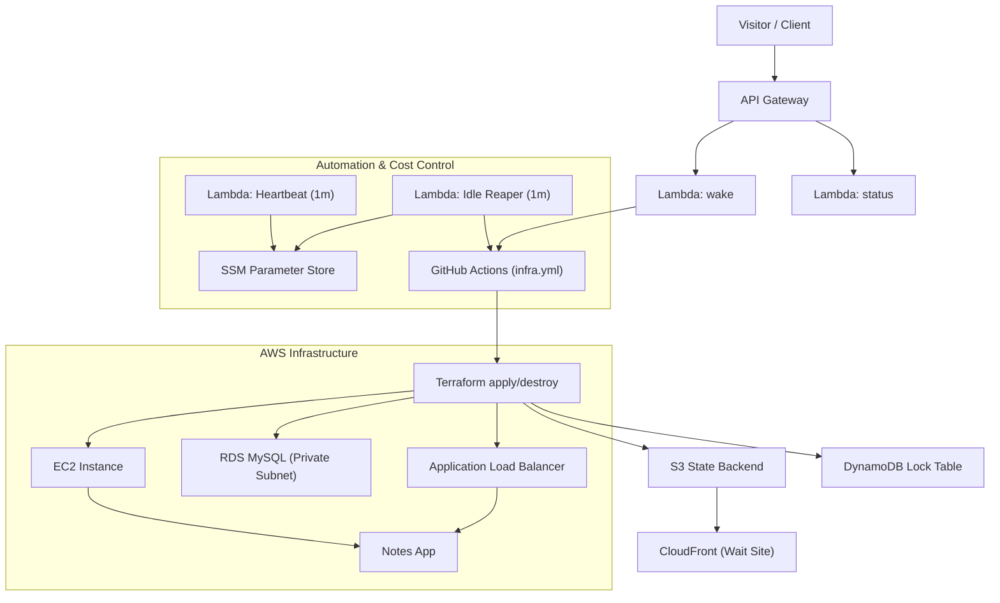

# 🚀 Ruslan AWS — Multi-Tier Infrastructure Demo

🌐 **Live Demo:** [https://app.multi-tier.space](https://app.multi-tier.space) → redirects to [https://multi-tier.space](https://multi-tier.space)  
An on-demand, cost-optimized environment that automatically wakes, deploys, and sleeps — powered by **AWS + Terraform + GitHub Actions**.

After provisioning completes, the main application becomes accessible at **[https://multi-tier.space](https://multi-tier.space)**, hosted behind an **Application Load Balancer** connected to the K3s EC2 backend.

---

## ⚙️ Architecture Overview

---

## 🧩 Key AWS Services Used

| Service | Purpose |
|----------|----------|
| **Lambda** | Wake, Status, Heartbeat, Idle-Reaper automation |
| **API Gateway (HTTP)** | Public endpoint for wake/status triggers |
| **EC2 (Amazon Linux 2023)** | Runs backend app and connects to ALB |
| **Application Load Balancer (ALB)** | Routes requests, performs health checks, and manages scaling |
| **RDS (MySQL, Private Subnet)** | Secure database isolated from public access |
| **S3 + CloudFront** | Static wait-site hosting (https://app.multi-tier.space) |
| **Route 53** | DNS management for `multi-tier.space` and `app.multi-tier.space` |
| **SSM Parameter Store** | Secure config & secret storage |
| **DynamoDB** | Terraform state locking table |
| **IAM Roles & OIDC** | Secure GitHub Actions integration |
| **CloudWatch Logs** | Centralized logging for Lambdas and workflows |

---

## 💤 Wake/Sleep Lifecycle

The environment sleeps when idle and wakes only when requested.

**Lambdas involved:**
- **`multi-tier-demo-heartbeat`** — updates `/multi-tier-demo/last_wake` every minute.
- **`multi-tier-demo-idle-reaper`** — checks last wake timestamp; if >10 min, triggers destroy via GitHub Actions.
- **`multi-tier-demo-status`** — reports live status (ready / waking / idle) to frontend.
- **`multi-tier-demo-wake`** — receives POST requests from the frontend and starts the apply workflow.

**Default timings:**
- Heartbeat: every **1 minute**
- Idle reaper destroy threshold: **10 minutes**
- Cooldown guard between destroys: **30 minutes**

---

## 📝 Application Layer — Notes App

This demo infrastructure hosts a lightweight **Notes App** built with a Node.js backend and a Bootstrap frontend.  
It demonstrates how a full stack application can be deployed, managed, and automatically destroyed on demand.

**Features:**
- Add, list, and delete notes through a simple REST API.  
- Frontend hosted on **S3 + CloudFront** (`https://app.multi-tier.space`).  
- Requests routed through **Application Load Balancer (ALB)** with health checks.  
- Data persisted in **Amazon RDS (MySQL)** located **in a private subnet** for enhanced security.  
- After successful provisioning, the live application becomes available at **[https://multi-tier.space](https://multi-tier.space)**.

---

### 🕒 Wait Page & Frontend Flow

The static **wait page** (hosted on [https://app.multi-tier.space](https://app.multi-tier.space)) acts as a **control dashboard** for managing infrastructure state.

When the system is idle, it remains online as a lightweight S3 + CloudFront site and provides:
- A **“Wake up”** button that triggers the GitHub Actions pipeline via API Gateway → Lambda → Terraform apply.  
- A **live progress bar** and **countdown timer** (≈12–15 minutes) indicating provisioning status.  
- A **status indicator** that enables the **“Open App”** button once the backend environment is fully deployed.  

Once provisioning is complete, users are automatically guided from the wait page (`app.multi-tier.space`) to the running application at **https://multi-tier.space**, served through the ALB connected to the K3s EC2 backend.

Both `app.multi-tier.space` and `multi-tier.space` domains are managed via **Route 53** and integrated with CloudFront distributions.  
This design ensures **zero-cost idle time** — compute resources (EC2, RDS, ALB) are active only while the app is awake, while the static wait-site remains accessible 24/7.

---

## 🧾 License

Released under the **MIT License** — feel free to use, fork, and learn from it.  
© Ruslan Dashkin (Ruslan AWS)
