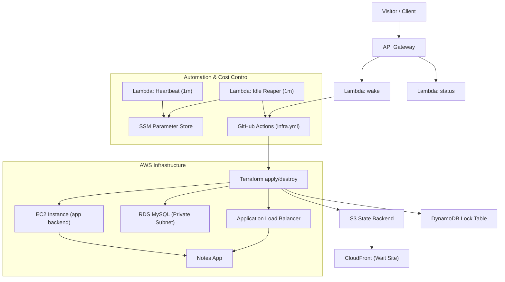
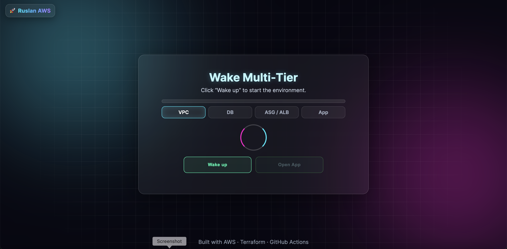
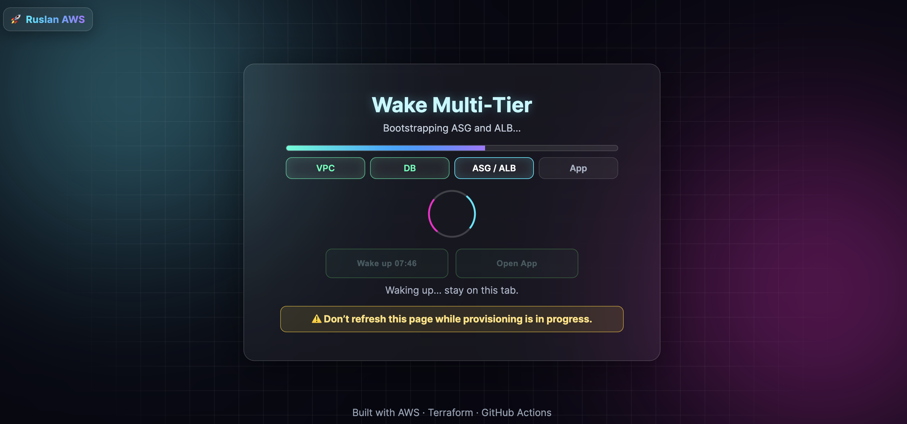
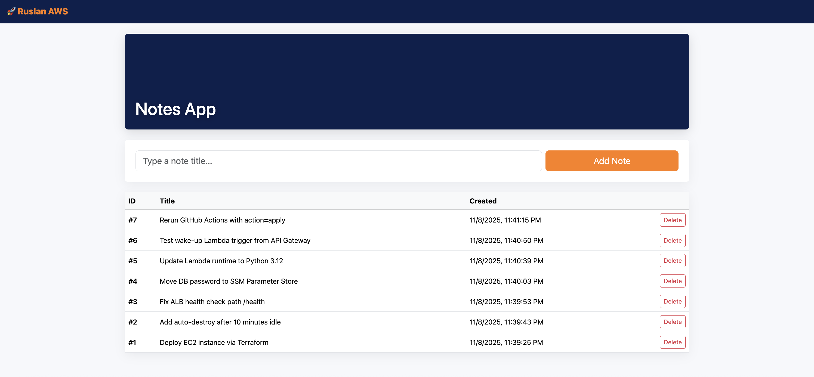
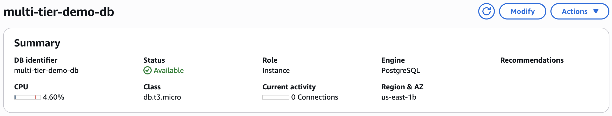
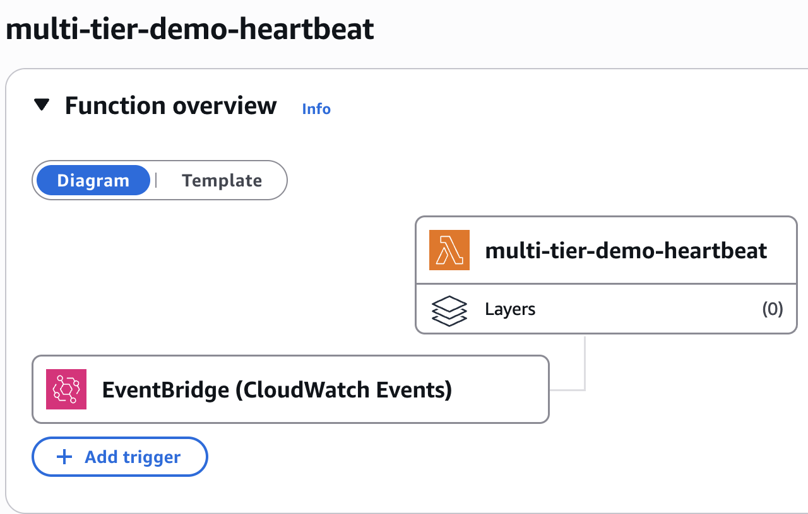
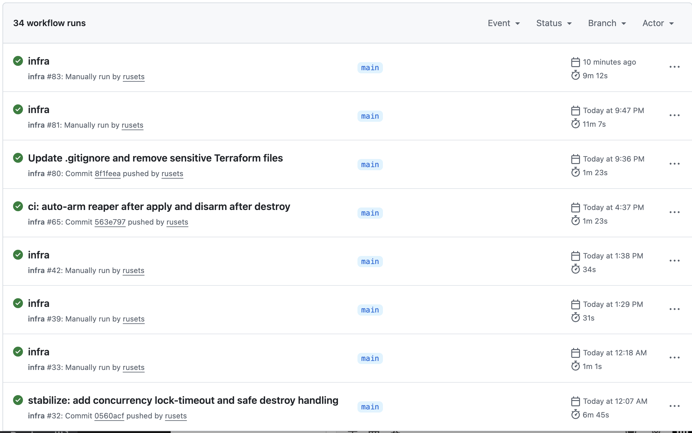

# 🚀 Ruslan AWS — Multi-Tier Infrastructure Demo


🌐 **Wait Page:** [https://app.multi-tier.space](https://app.multi-tier.space)  
🌐 **Main App:** [https://multi-tier.space](https://multi-tier.space)

This project demonstrates a **fully automated, cost-optimized multi-tier infrastructure on AWS**, provisioned via **Terraform** and orchestrated with **GitHub Actions**.  
It showcases **on-demand environment wake/sleep**, **secure secret storage (SSM Parameter Store)**, and **serverless orchestration (API Gateway + Lambda)** for real-world DevOps automation.

The solution provisions a complete **three-tier architecture** — frontend, application, and database — and automatically destroys idle resources to achieve near-zero cost.

---

## ⚙️ Architecture Overview



---

## 🧩 Key AWS Services Used

| Service | Purpose |
|---|---|
| **Lambda** | Wake, Status, Heartbeat, Idle-Reaper automation |
| **API Gateway (HTTP)** | Public endpoint for wake/status triggers |
| **EC2 (Amazon Linux 2023)** | Runs backend app and connects to ALB |
| **Application Load Balancer (ALB)** | Routes requests, performs health checks, and manages scaling |
| **RDS (MySQL, Private Subnet)** | Secure database isolated from public access |
| **S3 + CloudFront** | Static wait-site hosting (`app.multi-tier.space`) |
| **Route 53** | DNS management for `multi-tier.space` and `app.multi-tier.space` |
| **SSM Parameter Store** | Secure config & secret storage |
| **DynamoDB** | Terraform state locking table |
| **IAM + OIDC (GitHub)** | Short‑lived credentials for CI |
| **CloudWatch Logs** | Centralized logging for Lambdas and workflows |

---

## 💤 Wake/Sleep Lifecycle

The environment sleeps when idle and wakes only when requested.

**Lambdas involved:**
- **`multi-tier-demo-heartbeat`** — updates `/multi-tier-demo/last_wake` every minute.
- **`multi-tier-demo-idle-reaper`** — checks last wake timestamp; if threshold exceeded, triggers `destroy` via GitHub Actions.
- **`multi-tier-demo-status`** — reports live status (ready / waking / idle) to frontend.
- **`multi-tier-demo-wake`** — receives POST requests from the wait page and starts the `apply` workflow.

**Default timings (current):**
- Heartbeat: every **1 minute**
- Idle reaper destroy threshold: **10 minutes**
- Cooldown guard between destroys: **30 minutes**

---

## 📝 Application Layer — Notes App

This demo infrastructure hosts a lightweight **Notes App** built with a Node.js backend and a Bootstrap frontend.  
It demonstrates how a full‑stack application can be deployed, managed, and automatically destroyed on demand.

**Features:**
- Add, list, and delete notes through a simple REST API.  
- Frontend hosted on **S3 + CloudFront** (`https://app.multi-tier.space`).  
- Requests routed via **ALB** with health checks.  
- Data persisted in **Amazon RDS (MySQL)** located **in a private subnet** for enhanced security.  
- After successful provisioning, the live app is served at **https://multi-tier.space**.

---

### 🕒 Wait Page & Frontend Flow

The static **wait page** (hosted on [https://app.multi-tier.space](https://app.multi-tier.space)) acts as a **control dashboard** for managing infrastructure state.

When the system is idle, it remains online as a lightweight S3 + CloudFront site and provides:
- A **“Wake up”** button that triggers the GitHub Actions pipeline via API Gateway → Lambda → Terraform apply.  
- A **live progress bar** and **countdown timer** (≈12–15 minutes) indicating provisioning status.  
- A **status indicator** that enables the **“Open App”** button once the backend environment is fully deployed.  

Both `app.multi-tier.space` and `multi-tier.space` domains are managed via **Route 53** and integrated with CloudFront.  
This design ensures **zero‑cost idle time** — compute resources (EC2, RDS, ALB) are active only while the app is awake, while the static wait‑site remains accessible 24/7.

---

## 📸 Screenshots













---

## 📁 Project Structure

```
aws-multi-tier-infra/
├── app
│   ├── package.json
│   ├── public
│   └── server.js
├── bootstrap
│   └── user_data.sh
├── build
├── docs
├── infra
│   ├── alb_domain.tf
│   ├── artifacts.tf
│   ├── backend.tf
│   ├── control-plane/
│   │   ├── api.tf
│   │   ├── backend.tf
│   │   ├── dist/
│   │   ├── idle.tf
│   │   ├── lambdas.tf
│   │   ├── outputs.tf
│   │   ├── terraform.tfvars.example
│   │   ├── variables.tf
│   │   └── versions.tf
│   ├── locals.paths.tf
│   ├── main.tf
│   ├── outputs.tf
│   ├── providers.tf
│   ├── ssm.tf
│   └── variables.tf
├── lambda
│   ├── heartbeat
│   ├── idle_reaper
│   ├── status
│   └── wake
├── scripts
│   └── rdapp.service
└── wait-site
    └── index.html
```

---

## 🔧 Environment Variables / Parameters

| Name | Location | Description |
|---|---|---|
| `/multi-tier-demo/github_token` | **SSM Parameter Store** | Secure GitHub PAT used by Idle Reaper |
| `/multi-tier-demo/last_wake` | **SSM Parameter Store** | Timestamp of last heartbeat signal |
| `/multi-tier-demo/destroy_dispatched_epoch` | **SSM Parameter Store** | Guard to prevent repeated destroys |
| `IDLE_MINUTES` | **Lambda Env (idle_reaper)** | Threshold before triggering destroy |
| `GH_WORKFLOW` | **Lambda Env** | Target GitHub Actions workflow name |
| `ASG_NAME` | **Lambda Env** | (Optional) AutoScaling group name |
| `REGION` | **Lambda Env** | AWS region used for API calls |

---

## 💡 Cost Optimization Principles

- Auto‑destroy idle infrastructure via Idle‑Reaper Lambda.  
- Stateless backend (S3 + DynamoDB) allows fast re‑provisioning.  
- Minimal EC2 and RDS footprint to stay within credits.  
- Database in **private subnets** with no public exposure.  
- ALB health checks drive stability and cost‑efficient uptime.  
- DNS hosted in **Route 53**; GitHub OIDC replaces long‑lived IAM keys.  

Estimated runtime cost: **<$1/day** when active; **~$0 when sleeping.**

---

## 🧰 Common Terraform & AWS CLI Commands

### Terraform Lifecycle
```bash
terraform init
terraform plan -out=tfplan
terraform apply -auto-approve tfplan
terraform destroy -auto-approve
```

### AWS CLI Checks
```bash
aws ssm get-parameter --name /multi-tier-demo/last_wake --query 'Parameter.Value' --output text
aws logs tail /aws/lambda/multi-tier-demo-idle-reaper --follow
aws events list-rules --name-prefix multi-tier-demo
aws lambda get-function-configuration --function-name multi-tier-demo-idle-reaper --query 'Environment.Variables.IDLE_MINUTES' --output text
```

---

## 🔐 Secrets Management

All secrets (GitHub token, DB credentials, API keys) are stored in **AWS SSM Parameter Store** as **SecureString**.  
Terraform and Lambdas read them dynamically — no plaintext secrets in `.tfvars` or source code.

---

## 🚀 GitHub Actions Automation

- Workflow: `.github/workflows/infra.yml`  
- Triggers: `workflow_dispatch`, `repository_dispatch`, or wake via Lambda  
- Uses **OIDC federated role** for short‑lived AWS credentials  
- Built‑in **kill switch**: repository variable `INFRA_ARMED` must be `on`  
- Concurrency control ensures one infra job at a time

---

## 💵 Budget & Credits

Optimized for **AWS Free Tier / Student Credits**:
- Minimal EC2 runtime (short active window)
- RDS stopped outside wake period
- S3/CloudFront static content billed in pennies
- DynamoDB lock table `PAY_PER_REQUEST`
- GitHub Actions used only when invoked by API

---

## 🧠 Quick Reference

| Command | Purpose |
|---|---|
| `gh workflow run infra.yml -f action=apply -f auto_approve=true` | Manually start environment |
| `gh variable set INFRA_ARMED -R rusets/aws-multi-tier-infra -b on` | Enable automated destroy/apply |
| `aws ssm delete-parameter --name /multi-tier-demo/destroy_dispatched_epoch` | Reset cooldown guard |
| `aws lambda invoke --function-name multi-tier-demo-idle-reaper --payload '{}' /dev/stdout` | Manual reaper test |
| `aws cloudfront create-invalidation --distribution-id EVOB3TLZSKCR0 --paths /index.html` | Force refresh wait page |

---

## 🧾 License

Released under the **MIT License** — feel free to use, fork, and learn from it.  
© Ruslan Dashkin (🚀Ruslan AWS)
