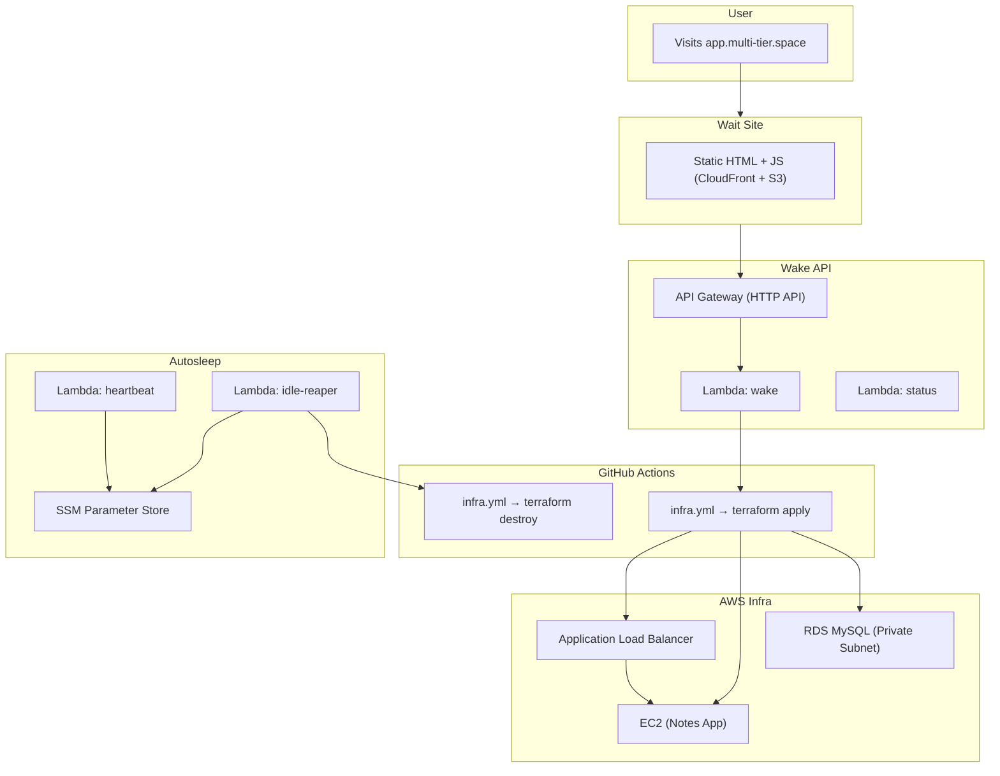

```mermaid
flowchart TD

%% USER
subgraph User["User"]
U["Visits app.multi-tier.space"]
end

%% WAIT SITE
subgraph Wait["Wait Site"]
FE["Static HTML + JS (CloudFront + S3)"]
end

%% WAKE API
subgraph API["Wake API"]
APIGW["API Gateway (HTTP API)"]
LWAKE["Lambda: wake"]
LSTATUS["Lambda: status"]
end

%% CI/CD
subgraph CI["GitHub Actions"]
WF_APPLY["infra.yml → terraform apply"]
WF_DESTROY["infra.yml → terraform destroy"]
end

%% INFRASTRUCTURE
subgraph Infra["AWS Infra"]
ALB["Application Load Balancer"]
EC2["EC2 (Notes App)"]
RDS["RDS MySQL (Private Subnet)"]
end

%% AUTOSLEEP
subgraph Autosleep["Autosleep"]
HB["Lambda: heartbeat"]
IR["Lambda: idle-reaper"]
SSM["SSM Parameter Store"]
end

U --> Wait
Wait --> APIGW
APIGW --> LWAKE
LWAKE --> WF_APPLY

WF_APPLY --> ALB
WF_APPLY --> EC2
WF_APPLY --> RDS

ALB --> EC2

HB --> SSM
IR --> SSM
IR --> WF_DESTROY
```