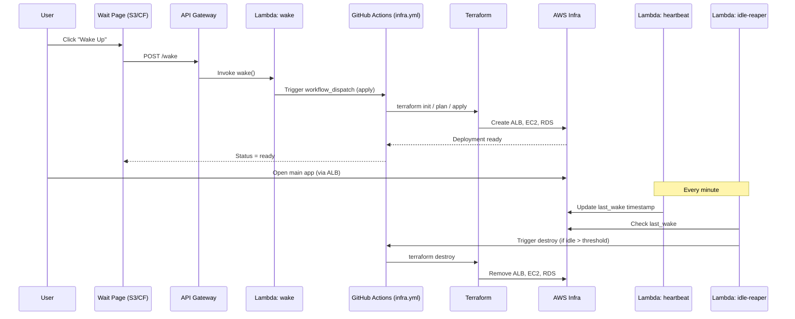

```mermaid
sequenceDiagram
    participant User
    participant WaitPage as Wait Page (S3/CF)
    participant APIGW as API Gateway
    participant LW as Lambda: wake
    participant GHA as GitHub Actions (infra.yml)
    participant TF as Terraform
    participant AWS as AWS Infra
    participant HB as Lambda: heartbeat
    participant IR as Lambda: idle-reaper

    User->>WaitPage: Click "Wake Up"
    WaitPage->>APIGW: POST /wake
    APIGW->>LW: Invoke wake()
    LW->>GHA: Trigger workflow_dispatch (apply)

    GHA->>TF: terraform init / plan / apply
    TF->>AWS: Create ALB, EC2, RDS
    AWS-->>GHA: Deployment ready

    GHA-->>WaitPage: Status = ready
    User->>AWS: Open main app (via ALB)

    Note over HB,IR: Every minute
    HB->>AWS: Update last_wake timestamp
    IR->>AWS: Check last_wake
    IR->>GHA: Trigger destroy (if idle > threshold)

    GHA->>TF: terraform destroy
    TF->>AWS: Remove ALB, EC2, RDS
```